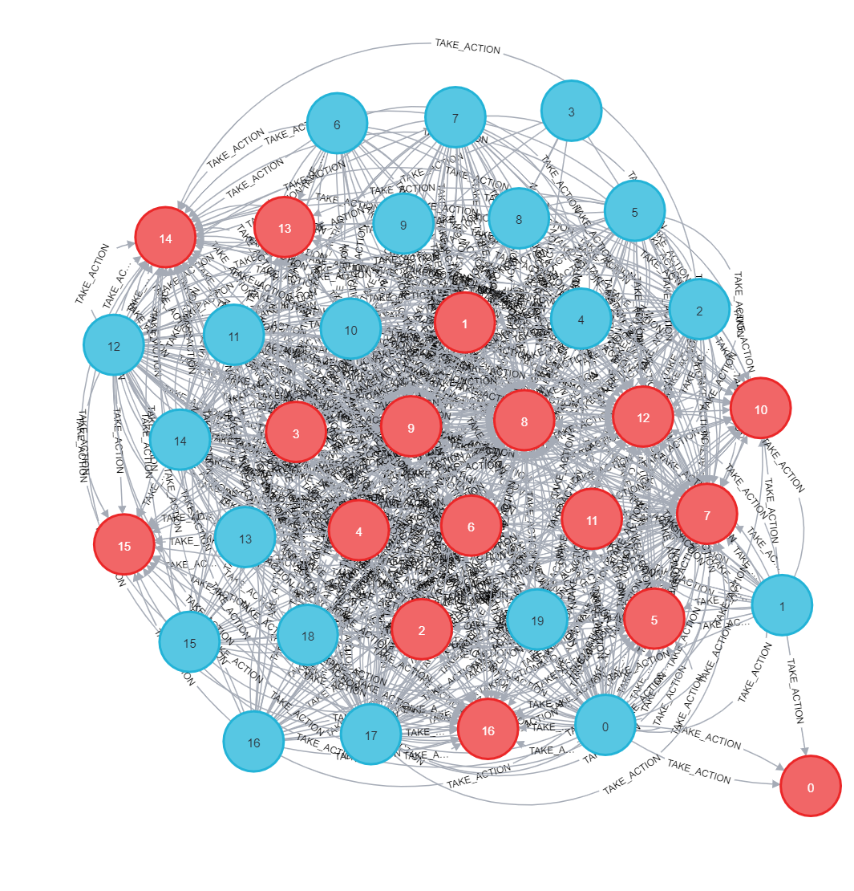

# Neo4j Social Network
A simulation of a social network using Neo4j DBMS. 

The program was developed and tested on an <b>Ubuntu 22.04</b> and a <b>Windows 11</b> machine.

# Graph Preview

### [Contents](#)
1. [**Description**](#descr)
2. [Installing & Setup](#inst)
3. [Running the functions](#run)
4. [Results](#results)
5. [Notes](#notes)

### [**Description**](#) 

This project simulates how data could be stored and retrieved from a graph database, in a social-network context. The data are retrieved from the Stanford Large Network Dataset Collection (`https://snap.stanford.edu/data/#socnets`) and loaded in the Neo4j DB using Python.

### [**Installing & Setup**](#) 

Download Neo4j and create a Database

1. Download Neo4j Desktop. (`https://neo4j.com/download/`)

2. Create a project.

3. Inside the project, create a DBMS (Keep the name and password, will be used it later)

4. Run the Database.

### [**Running the functions**](#) 

1. Clone the repository (https://github.com/Mike-gag/Neo4j-Social-Network.git)

2. Replace the `NEO4J_USER` & `NEO4J_PASSWORD` variables values down in the `neo4j_importer.py` script with the ones you used earlier in the creation of the Neo4j DB.

3. Run the `neo4j_importer.py` script (it does take some time, ≈ 1 hour with Ryzen 5, 16GB RAM, 50mbps steady internet connection)

4. In the console/browser of the DB you created on Neo4j type any query you want

A brief overview of what each function implements.
* Function 1:  Show a small portion of your graph database
* Function 2: Count all users, count all targets, count all actions
* Function 3: Show all actions (actionID) and targets (targetID) of a specific user
* Function 4: For each user, count his/her actions
* Function 5: For each target, count how many users have done this target
* Function 6: Count the average actions per user
* Function 7: Show the userID and the targetID, if the action has positive Feature2
* Function 8: For each targetID, count the actions with label “1” 

### [**Results**](#) 
After running the functions, you can cross-check your outputs with the ones on the outputs directory (https://github.com/Mike-gag/Neo4j-Social-Network/tree/main/outputs).

### [**Notes**](#) 
This project was made as an assignement of the Big Data Management Systems course at DMST AUEB, lectures by Damianos Chatziantoniou.
 
 
***Team members***
 
Gaganis Michail 8200234
 
Pampidi Eugenia 8200129